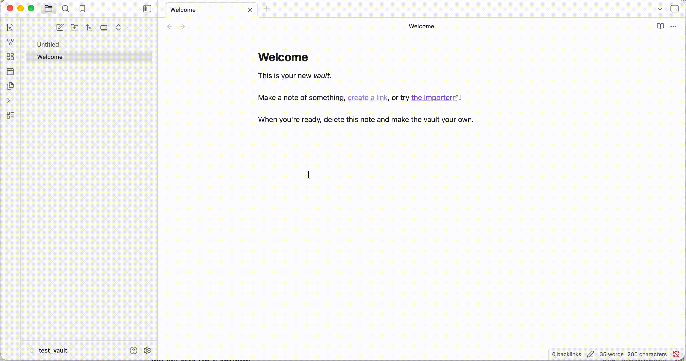

# At Inserter — Obsidian Plugin

Type `@` in the editor to open a context menu for quick date insertion. Dates are displayed as styled pills with a configurable format, and clicking a pill opens a date picker to change the value.

## Demo



## Features

- **@ trigger** — type `@` to open a suggestion popup with date options (Today, Tomorrow)
- **Formatted date pills** — dates (`YYYY-MM-DD`) in your notes are rendered as visual pills with a customizable display format (e.g., `Mar 17, 2026`, `Monday 17/03/2026`)
- **Click to edit** — click any date pill to open a date picker and update the date in-place
- **Source mode support** — pills are only shown in Live Preview; Source mode shows raw `YYYY-MM-DD`
- **Configurable trigger** — change `@` to any symbol you prefer
- **Toggle highlighting** — enable/disable date pills via settings

## Settings

| Setting | Description | Default |
|---------|-------------|---------|
| Trigger symbol | Character that opens the insertion menu | `@` |
| Display date format | Format for date pills and popup preview | `YYYY-MM-DD` |
| Highlight dates | Render dates as styled pills in the editor | On |

### Format tokens

`YYYY` year, `MM` month (01-12), `DD` day (01-31), `MMM` short month (Jan), `MMMM` full month (January), `ddd` short day (Mon), `dddd` full day (Monday)

Example: `ddd, MMM DD YYYY` renders as `Tue, Mar 17 2026`

## Installation

### From release (recommended)

1. Download `main.js`, `manifest.json`, and `styles.css` from the [latest release](https://github.com/NikolasSumrak/obisdian-at-plugin/releases/latest)
2. In your vault folder, create directory `.obsidian/plugins/at-symbol-inserter/`
3. Move the downloaded files into that directory
4. Open Obsidian → **Settings → Community plugins** → enable **At Inserter**

### Build from source

1. Clone the repo and build:
   ```bash
   git clone https://github.com/NikolasSumrak/obisdian-at-plugin.git
   cd obisdian-at-plugin
   npm install && npm run build
   ```

2. Copy the built files to your vault:
   ```bash
   mkdir -p "/path/to/your-vault/.obsidian/plugins/at-symbol-inserter"
   cp build/main.js build/manifest.json build/styles.css \
      "/path/to/your-vault/.obsidian/plugins/at-symbol-inserter/"
   ```

3. Open Obsidian → **Settings → Community plugins** → enable **At Inserter**

### For development (symlink)

```bash
ln -s /path/to/obisdian-at-plugin/build \
   "/path/to/your-vault/.obsidian/plugins/at-symbol-inserter"
```

Then run `npm run dev` for watch mode — changes rebuild automatically.

## How it works

- The `@` trigger uses Obsidian's `EditorSuggest` API
- Date pills use CodeMirror 6 `ViewPlugin` with `MatchDecorator` and replace widget decorations
- The underlying markdown always stores dates as `YYYY-MM-DD` — the pill is purely visual
- Clicking a pill uses the browser's native date picker to select a new date
